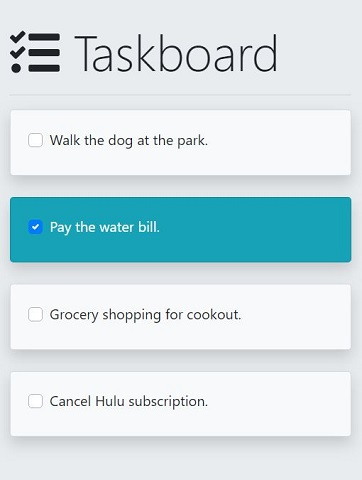

# React Taskboard App

A basic React application that demonstrates managing state for a list of tasks using functional and class based components.

 

### Dependencies

- react ^16.8.6
- react-dom ^16.8.6
- react-scripts 2.1.8
- bootstrap ^4.3.1
- fortawesome/fontawesome-svg-core ^1.2.17
- fortawesome/free-solid-svg-icons ^5.8.1
- fortawesome/react-fontawesome ^0.1.4

### Install

#### `npm install`

Installs the applications dependencies.

### Running

#### `npm start`

Runs the app in the development mode. Open [http://localhost:3000](http://localhost:3000) to view it in the browser. The page will reload if you make edits. You will also see any lint errors in the console.

#### `npm run build`

Builds the app for production to the `build` folder. It correctly bundles React in production mode and optimizes the build for the best performance. The build is minified and the filenames include the hashes. See the official documentation about [deployment](https://facebook.github.io/create-react-app/docs/deployment) for more information.

